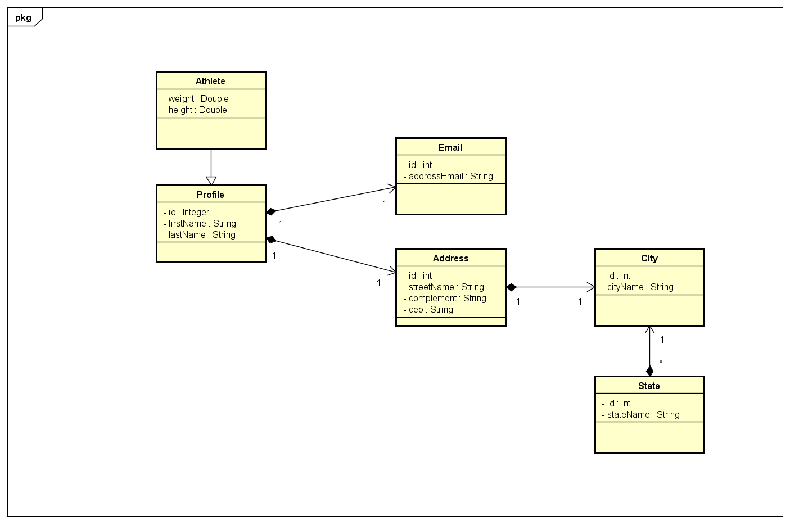

# API-Athlete

## Technologies

- Api-rest implemented to register athletes.
- An architecture based on clean architecture was used.
### Backend
- Java
- Spring
- JPA/Hibernate
### Data persistence
- MySQL
- H2-Database *for production*

## UML of the project in production

## How to run the project
## End points
